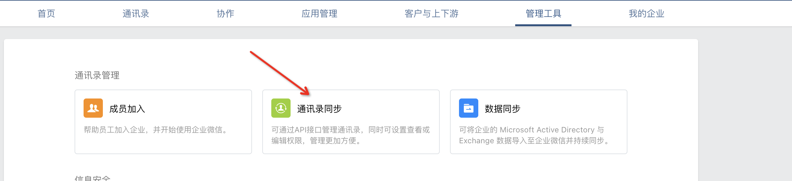
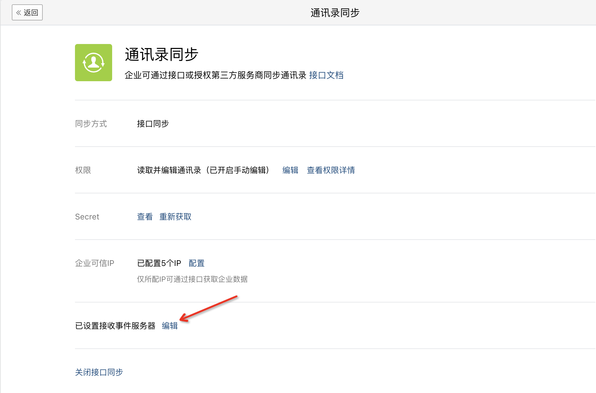
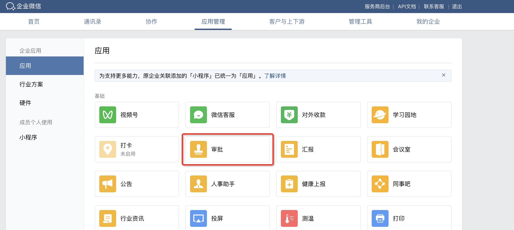
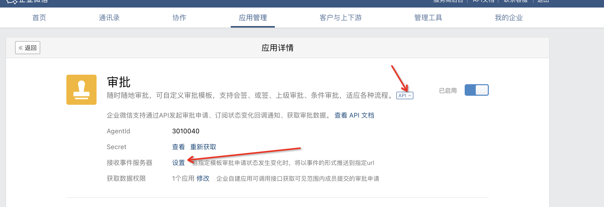
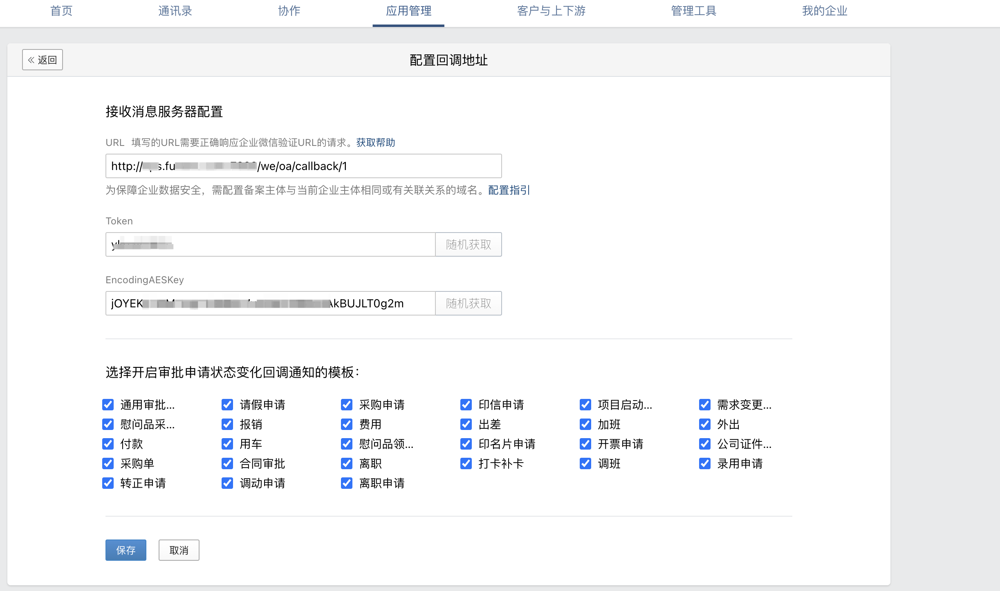
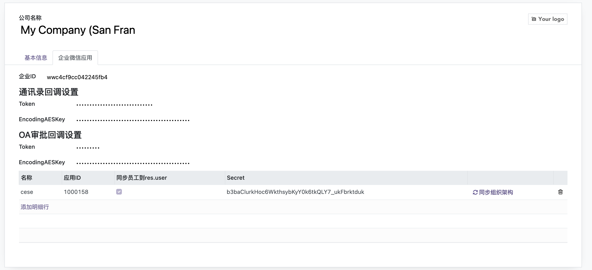

# xy_wechat
适用于Odoo16版本的企业微信模块

<div>  

[](https://github.com/xunonxyz/xy_wechat/blob/master/LICENSE.md)
[](https://github.com/xunonxyz/xy_wechat/issues)
[](https://github.com/odoo/odoo/tree/16.0)

</div>

## ✨ 特点

- 采用python升级特性协程进行同步，速度比多线程更快。同步50人公司组织架构只需10s左右
- 仅inherit了少量model，避免多层inherit冗余嵌套影响加载性能
- 支持Odoo多公司切换，每个公司可设置多个企业微信应用
- 使用Hr模块为基础进行员工管理，而不是直接res.users，充分利用Odoo原生模块功能
- 完整的i18n简中翻译，默认使用英文
- 包含企业微信内建应用必备功能，去掉了其余冗余而普遍用不上的功能，减少模块大小

## 🖥 环境支持

- Odoo16版本
- postgresql12及以上版本（Odoo16的hr模块中使用了Json字段，需要数据库有Json函数支持）
- python3.7及以上（使用了协程特性）
- 安装python的`aiohttp`和`pycryptodome`库

## 📦 安装

在Odoo的应用里找到`Wechat Enterprise`模块激活即可安装，安装后模块名称翻译会被加载变成「企业微信」

## ✨ 包含功能

|               功能名称                | 是否支持 |
| :-----------------------------------: | :------: |
|            多公司用户切换             |    √     |
|  企业微信应用access_token获取并缓存   |    √     |
| WW_verify_xxx.txt域名校验文件一键配置 |    √     |
| 企业微信应用通讯录部门、成员一键同步  |    √     |
|   企业微信通讯录部门、成员变更回调    |    √     |
|      企业微信二维码扫码登录系统       |    √     |
|       企业微信网页跳转登录系统        |    √     |
|   向企业微信上传临时素材、永久图片    |    √     |
|     推送、撤回企业微信各类型消息      |    √     |
|            企业微信OA审批             |    √     |

## ✨ 后续其他计划

- odoo工作流模块，对标java的Camunda工作流实现，可在线编辑
- odoo oa模块
- odoo商城模块
- ......

## 🔨 使用

注：因为odoo的hr模块是以部门为单位进行管理，所以目前仅支持同步企业微信应用可见范围以部门为单位的情况，有单独可见人员时不会同步单独可见人员，

以下说明文档包含关键配置使用，其余具体调用函数请到源码自行查看

### 配置企业微信应用参数

#### 在企业微信中配置

> 注：以下两个配置在保存时企业微信均会发送请求到配置的地址进行验证，故需要企业微信和odoo配置同时进行

##### 通讯录回调参数






URL处填写`{odoo服务器地址，不能使用localhost}/we/mail_list/callback/{回调时参数对应的odoo中companyid}`，具体接口见代码controllers/controllers:we_callback

Token、EncodingAESKey点击随机获取即可

##### OA审批回调参数







URL处填写`{odoo服务器地址，不能使用localhost}/we/oa/callback/{回调时参数对应的odoo中companyid}`，具体接口见代码controllers/controllers:we_oa_callback

Token、EncodingAESKey点击随机获取即可

#### 在odoo中配置

在「Odoo系统 - 设置 - 用户&公司」页面，选中公司后切换到「企业微信应用」选项卡进行参数配置

注：如果勾选了应用中的「同步员工到res.user」则在保存hr.employee记录时也会创建res.users记录，否则仅创建hr.employee记录



##### 配置通讯录回调参数

将在企业微信中生成的Token和EncodingAESKey填入参数处

##### 配置OA审批回调参数

将在企业微信【审批应用】中生成的Token和EncodingAESKey填入参数处


### 同步

配置完参数后点击「同步组织架构」按钮即可。同步是在后端异步进行，不会阻塞当前操作，但尽量不要进行用户、部门的变更、创建、删除等操作。

同步完成或失败后均会有通知窗进行通知。  


### 同步日志

每次同步的结果、报错代码栈、花费的时间等信息均可以进行查看。

在「员工 - 企业微信模块日志」页面可进行查看  

### 配置扫码登录后台

扫码组件在模块内部作为一个widget进行封装，可以在任意地方进行使用，有两种方式进行使用
1. 在view中能使用`<widget>`标签的地方使用`<widget name="we_qrcode" app_id="传入app的在系统内的id"/>`即可
2. 将使用owl进行封装的扫码组件进行引入，然后在需要使用的地方mount扫码组件，比如：  
```javascript
import WEQrcode from '@xy_wechat/js/we_qrcode_widget';
const { mount, Component } = owl;

mount(WEQrcode, document.body, { props: {appId: '传入app的在系统内的id'} });
```

在「员工 - 企业微信模块日志」页面可进行查看


## ❤️ 支持

富能通企业官网：https://www.funenc.com/

免费后端培训视频系列：https://www.bilibili.com/video/BV1rP411G7CZ/

知识星球Odoo源码解读：


更多模块请进群交流: 


